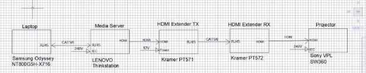
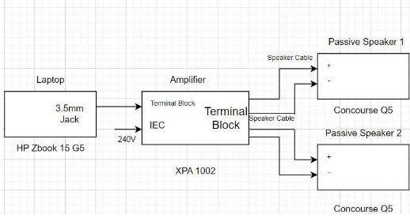
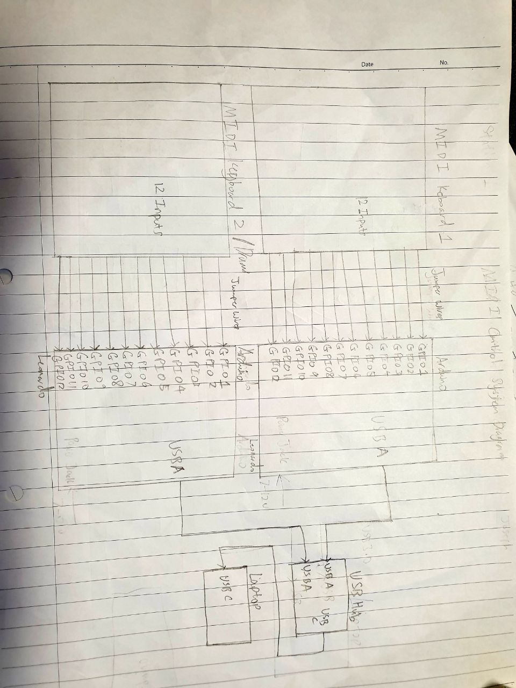

# EGL314 Team-B-Project-Space

## Software Required:<br>

Arduino IDE 1.8.16<br>
Reaper 6.8.0<br>
Wallpaper engine 2.2.18 <br>
Pandoras Box and Widget Designer<br>
### **Plugins**
Drums: https://decomposer.de/sitala/ <br>
Midi Keyboard: https://tal-software.com/products/tal-noisemaker<br>


## Hardware Required:<br>
Arduino Leonardo x 3<br>
Concourse Q5 speakers (nominal impedance 8Ohms, 35 Watts) x 2<br>
XPA 1002 power amplifier x 1<br>
Ultra Short Throw Projector, Sony VPL-SW630 x 1<br>
Remaco Motorised Screen (with Controller for Up, Stop, Down Relay control) x 1<br>
Laptops (HP ZBook 15 G5) x 2<br>
HDMI over-twisted pair transmitter, KRAMER PT-571 x 1<br>
HDMI over-twisted pair receiver, KRAMER PT-572+ x 1<br>
Media Server(Lenovo Thinkstation) x2<br>

USB type C to female LAN adapter x 2<br>

## Cables Required:<br>
HDMI cable x 2<br>
Terminal block to 4 bare end cable x 1<br>
3.5mm to 4-way terminal block cable x 1<br>
RJ45 LAN cable x 4<br>

## BOM List:<br>
Arduino Leonardo x 3

## Video 

## Audio

## Control


## Floor Plan


## Setup 


Phidgets that control the LED

The video on the monitors will show the keys that will be pressed by player 1 or 2 using the MIDI drumsticks. The LEDs on the 2 keyboards will also light up to indicate the correct keys to press

## Network Settings
```
Media server IP address: 192.168.0.12 
Laptop IP Address: 192.168.0.13
```
# Proof of concept 
## DIY MIDI Instruments


These are the Midi keyboard and drum user interfaces for the user to play on .
* The MIDI `eth0` interfaces is powered and controlled by a Arduino Leonardo micro-controller 
* The wires are connected from the Arduino to the aluminium tape which is used as a conductive sensor for the users to touch. When they touch the keys with the drumstick, it will register and play the desired tunes for the respective instruments.
## Audio Visual

Here is a photo of an audio visual response from wallpaper engine which is being translated from the musical notes that are being played by the user


This is the program for the MIDI instruments which is used to program the tunes and melody with the help of **Reaper software**.

# Minimum viable product
## Cooperative game

__This is the final product and its a multiplayer game, a song track will be played and players have to be in sync with the melody. It's all about the timing and reaction, the  2 players must be able to hit the key at the right moment when the tiles fall on to the light shown.__


__This game consist of the 2 instruments, console allows the user to pick either the 2 instrumennts displayed on the top, the drums or the piano.__

## Fixtures and Devices


**Description:** Touch Sensor. Used to start the video <br>
**Model:** 1110 <br>
**Manufacturer:** Phidgets <br>
**P/N** NA <br>

**Description:** Phidget Controller interface. Controls the touch sensor and LEDs <br>
**Model:** 1018 <br>
**Manufacturer:** Phidgets <br>
**P/N** NA <br>

**Description:** Projector <br>
**Model:** Sony VPL-SW630 <br>
**Manufacturer:** Sony <br>
**P/N** NA <br>

**Description:** Concourse Passive Speaker <br>
**Model:** Concourse Quad 5  <br>
**Manufacturer:** Yumpu <br>
**P/N** Q5 <br>

**Description:** Power Amplifier. Increases the power of the speakers<br>
**Model:** XPA 1002 <br>
**Manufacturer:** Extron <br>
**P/N:** 60-849-01 <br>

**Description:** Media Server. Allows the video to be displayed from the laptop to the monitors on the table<br>
**Model:** ThinkStation <br>
**Manufacturer:** Lenovo <br>
**P/N:** N/A <br>


