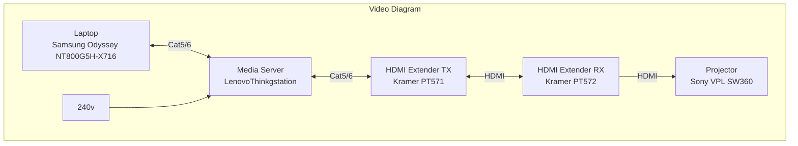
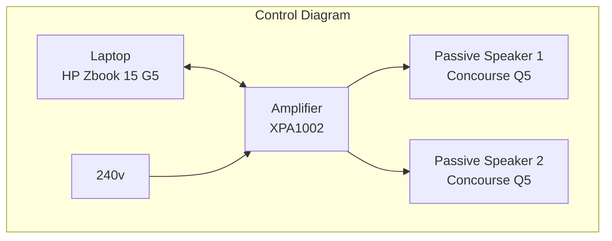

# EGL314 Team-B-Project-Space

## Software Required:<br>

Arduino IDE 1.8.16<br>
Reaper 6.8.0<br>
Wallpaper engine 2.2.18 <br>
### **Plugins**
Drums: https://decomposer.de/sitala/ <br>
Midi Keyboard: https://tal-software.com/products/tal-noisemaker<br>


## Hardware Required:<br>
Arduino Leonardo x 3<br>
Concourse Q5 speakers (nominal impedance 8Ohms, 35 Watts) x 2<br>
Ultra Short Throw Projector, Sony VPL-SW630 x 1<br>
Remaco Motorised Screen (with Controller for Up, Stop, Down Relay control) x 1<br>
Laptops (HP ZBook 15 G5) x 2<br>
HDMI over-twisted pair transmitter, KRAMER PT-571 x 1<br>
HDMI over-twisted pair receiver, KRAMER PT-572+ x 1<br>
Media Server(Lenovo Thinkstation) x1<br>

USB type C to female LAN adapter x 2<br>

## Cables Required:<br>
HDMI cable x 2<br>
Terminal blocl to 4 bare end cable x 1<br>
3.5mm to 4-way terminal block cable x 1<br>

RJ45 LAN cable x 4<br>

## BOM List:<br>
Arduino Leonardo x 3

## Setup 






## Media Server
```
IP address: 192.168.0.12 
```
## DIY MIDI Instruments


These are the Midi keyboard and drum user interfaces for the user to play on .
* The MIDI `eth0` interfaces is powered and controlled by a Arduino Leonardo micro-controller 
* The wires are connected from the Arduino to the aluminium tape which is use as a conductive sensors for the users to touch. When they touch, it will register the desired tunes for the respective instruments.
## Audio Visual

Here is a photo of a audio visual response from wallpaper engine which is being translated from the musical notes that are being played by the user


This is the program for the MIDI instruments which is used to programmed the tunes and melody from the help with **Reaper software**.


