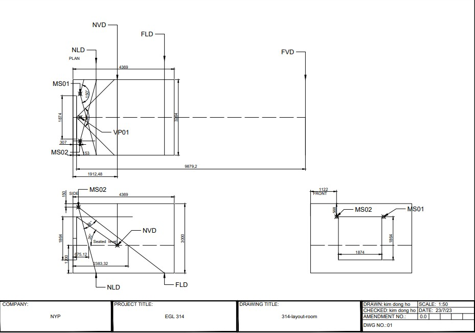
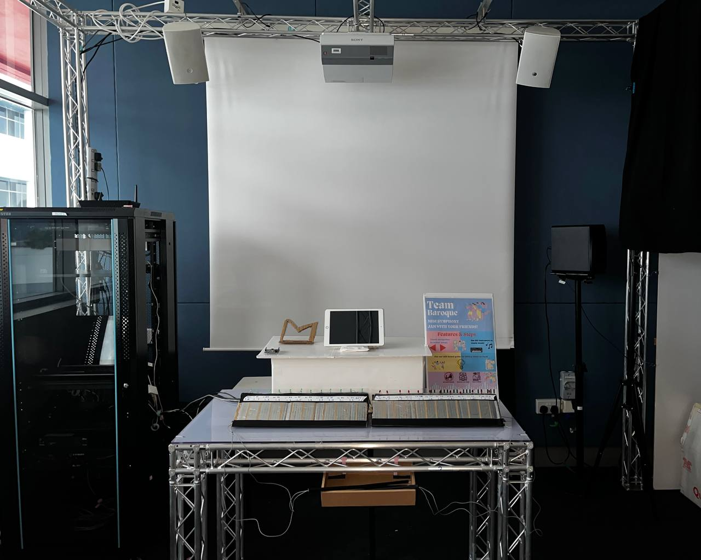
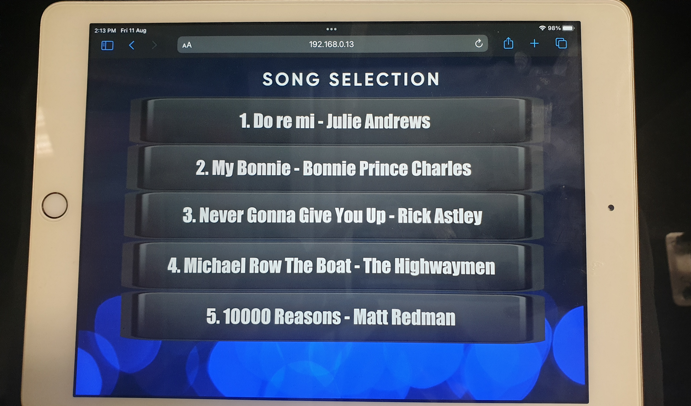
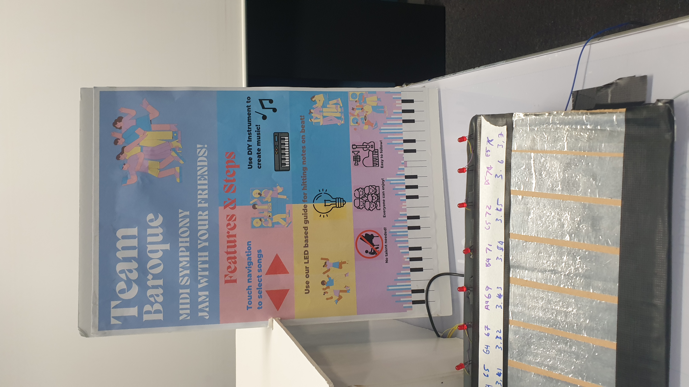
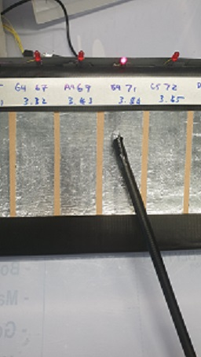

# MIDI SYMPHONY

## Software Required:<br>

Arduino IDE 1.8.16 - Programming the Arduino Leonardo instruments<br>
Reaper 6.8.0 - Used for audio production, creating the tunes of the instruments<br>
Wallpaper engine 2.2.18 <br>
Pandoras Box and Widget Designer - Used to display videos on the monitors, and program touch sensors and LEDs<br>
### **Plugins**
Drums: https://decomposer.de/sitala/ <br>
Midi Keyboard: https://tal-software.com/products/tal-noisemaker<br>


## Hardware Required:<br>
Arduino Leonardo x 3<br>
Concourse Q5 speakers (nominal impedance 8Ohms, 35 Watts) x 2<br>
XPA 1002 power amplifier x 1<br>
Ultra Short Throw Projector, Sony VPL-SW630 x 1<br>
Remaco Motorised Screen (with Controller for Up, Stop, Down Relay control) x 1<br>
Laptops (HP ZBook 15 G5) x 2<br>
HDMI over-twisted pair transmitter, KRAMER PT-571 x 1<br>
HDMI over-twisted pair receiver, KRAMER PT-572+ x 1<br>
Media Server(Lenovo Thinkstation) x2<br>

USB type C to female LAN adapter x 2<br>

## Cables Required:<br>
HDMI cable x 2<br>
Terminal block to 4 bare end cable x 1<br>
3.5mm to 4-way terminal block cable x 1<br>
RJ45 LAN cable x 4<br>

## Video 

## Audio

## Control


## Floor Plan



## Setup 


Phidgets that control the LEDs and sensors, they are connected to a laptop in the rack

The video on the monitors will show the keys that need to be pressed by player 1 or 2 using the drumsticks. The red and green LEDs on the 2 keyboards will also light up to indicate the correct keys to press.Once the LEDs turn off the player has to let go of the key.


## Network Settings
```
Media server1 IP address: 192.168.0.12 
Media server2 IP address: 192.168.0.14
Laptop IP Address: 192.168.0.13
```
# Proof of concept 
## DIY MIDI Instruments


These are the Midi keyboard and drum user interfaces for users to play on.
* The MIDI `eth0` interfaces are powered and controlled by Arduino Leonardo micro-controllers
* The wires are connected from the Arduino to the aluminium tape which is used as a conductive sensor for the users to touch. When they touch the keys with the drumstick, it will register and play the desired notes for the respective instruments.

By clicking [here](MIDI_Code/MIDI_Code_Game_Drum_Keyboard/), will locate you to the folder of the various written program scripts responsible to register different musical notes mapped on the respective aluminium tape keys which emit the tunes when touched .

The program `MIDI_Code_Left_Hand.ino` and `MIDI_Code_Right_Hand.ino` for the MIDI instruments which is programed into the arduino leonardo and used to produce notes with the help of **Reaper software**.

# Minimum viable product
## Cooperative game

__This is Mode 1 and it is a multiplayer game, a song track will be played and players have to be in sync with the melody. It's all about the timing and reaction, the  2 players must be able to hit the key at the right moment when the tiles fall on to the light shown.__


__This is Mode 2, the game consist of the 2 instruments, console allows the user to play both 2 instruments displayed on the top, the drums and the piano.__

## Fixtures and Devices


**Description:** Touch Sensors. Used to start the videos. The Touch Sensor on the left will turn on Mode 1(musical multi-player game), and the Touch Sensor on the right will turn on Mode 2(musical percussion game) <br>
**Model:** 1110 <br>
**Manufacturer:** Phidgets <br>
**P/N** NA <br>

**Description:** Phidget Controller interface. Controls the touch sensor and LEDs <br>
**Model:** 1018 <br>
**Manufacturer:** Phidgets <br>
**P/N** NA <br>

**Description:** Projector, provides video output <br>
**Model:** Sony VPL-SW630 <br>
**Manufacturer:** Sony <br>
**P/N** NA <br>

**Description:** Concourse Passive Speaker, provides audio output <br>
**Model:** Concourse Quad 5  <br>
**Manufacturer:** Yumpu <br>
**P/N** Q5 <br>

**Description:** Power Amplifier.takes input signal from laptop and sends it to the speakers<br>
**Model:** XPA 1002 <br>
**Manufacturer:** Extron <br>
**P/N:** 60-849-01 <br>

**Description:** Media Server. Allows the video to be displayed from the laptop to the monitors on the table<br>
**Model:** ThinkStation <br>
**Manufacturer:** Lenovo <br>
**P/N:** N/A <br>

## Demo Video (**M**inimum **V**iable **P**roduct)

Here is a link for our multiplayer [musical game station 1][station1_url] to YouTube (Multiplayer), and the second [musical percussion station 2][station2_url].


[station1_url]: https://www.youtube.com/watch?v=DKCg_on9eKA&t=11s
[station2_url]: https://youtu.be/bg39pkCY94s

## Final Product

This is the outlook of our setup for our final product. We removed the drum kit instrument and the 2 monitors and added videos to be displayed from a projector for each song.

## Addtions
We added a mini Ipad which provided a UI(User Interface) song menu of 5 songs for players to pick. Once they've chosen, this will execute the LED sequence program which can be located under the folders [here](MIDI_Code/MIDI_Code_Game_Drum_Keyboard/) and the LED will light up in sequence according to the chosen song



## Poster 


## How to Play

### Step 1:
Players will have to pick a song of your choice from the song list on the Ipad 

### Step 2:
There will be a countdown of 3 seconds, for the players
to get ready 

### Step 3:
The LEDs on the keyboard will start flashing after the countdown and players can use the drumsticks to hit the keys according to the flashing LEDs. The speakers will play the tunes if the player touches a key with the drumstick.




