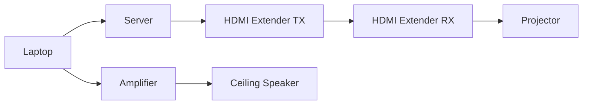
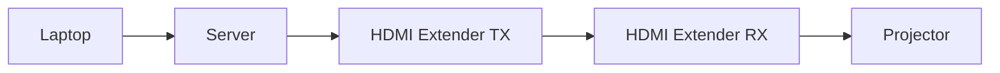

# System Diagram

```mermaid 
graph LR

A[Laptop]-->B[Server]-->C[HDMI Extender TX]-->D[HDMI Extender RX]-->E[Projector]


A[Laptop]-->F[Amplifier]
F-->G[Ceiling Speaker]
```

# Video

```mermaid 
graph LR

A[Laptop]-->B[Server]-->C[HDMI Extender TX]-->D[HDMI Extender RX]-->E[Projector]

```

# Audio 

```mermaid 
graph LR

A[Laptop]-->B[Amplifier]-->C[Ceiling Speaker]

```

