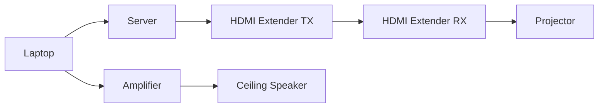
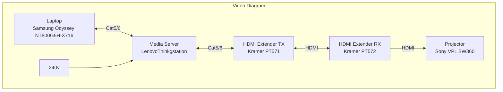
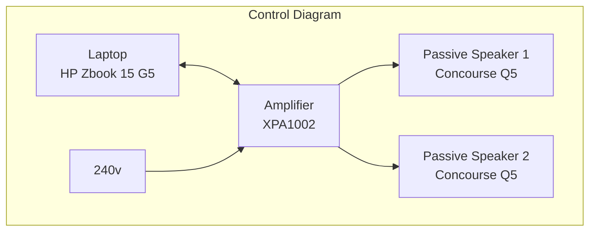

# System Diagram

```mermaid 
graph LR

A[Laptop]-->B[Server]-->C[HDMI Extender TX]-->D[HDMI Extender RX]-->E[Projector]


A[Laptop]-->F[Amplifier]
F-->G[Ceiling Speaker]
```

# Video

```mermaid
graph 
    subgraph Video Diagram
        A[Laptop<br>Samsung Odyssey NT800G5H-X716] <-- Cat5/6 --> B[Media Server<br>LenovoThinkgstation] <--Cat5/6--> C[HDMI Extender TX<br> Kramer PT571]<--HDMI-->D[HDMI Extender RX<br>Kramer PT572] --HDMI--> E[Projector<br>Sony VPL SW360] 
    F[240v] --> B
    end
```

# Audio 

```mermaid 
flowchart 
    subgraph Control Diagram
        A[Laptop<br>HP Zbook 15 G5] <--> B[Amplifier<br> XPA1002] --> C[Passive Speaker 1<br> Concourse Q5]
        B[Amplifier<br> XPA1002] --> D[Passive Speaker 2<br> Concourse Q5]
    F[240v] --> B
    end

```
# Control

